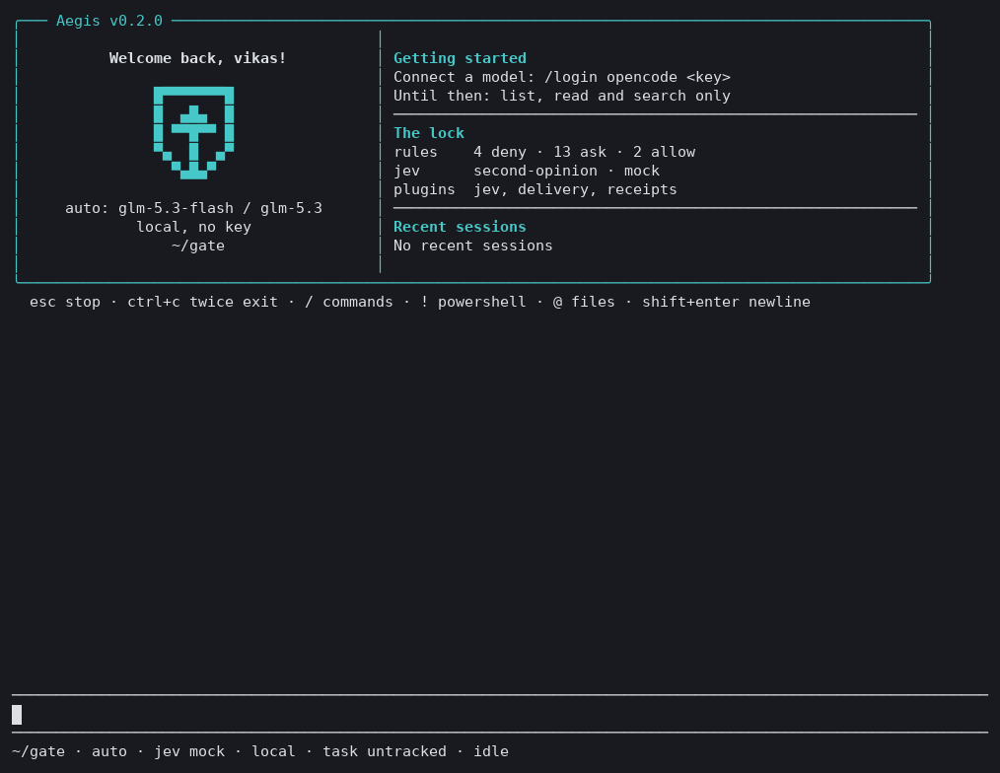
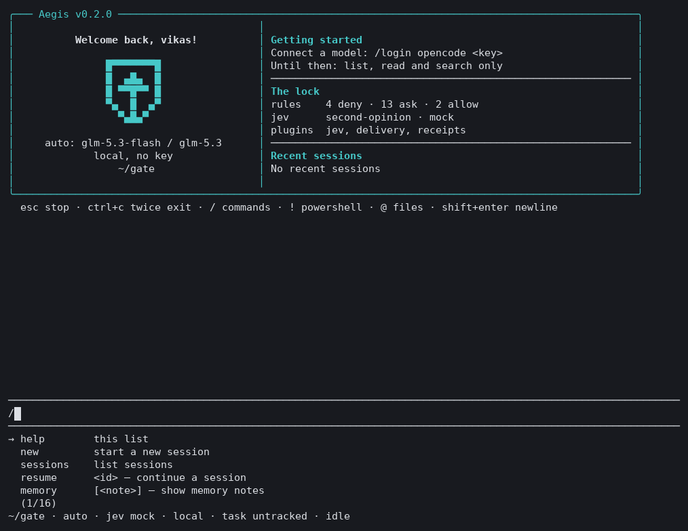
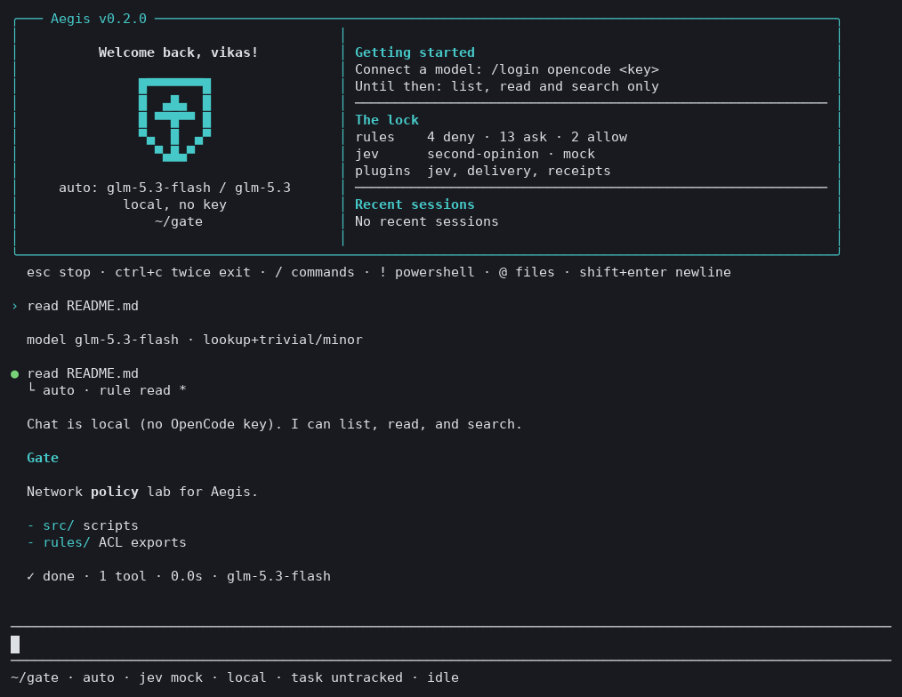
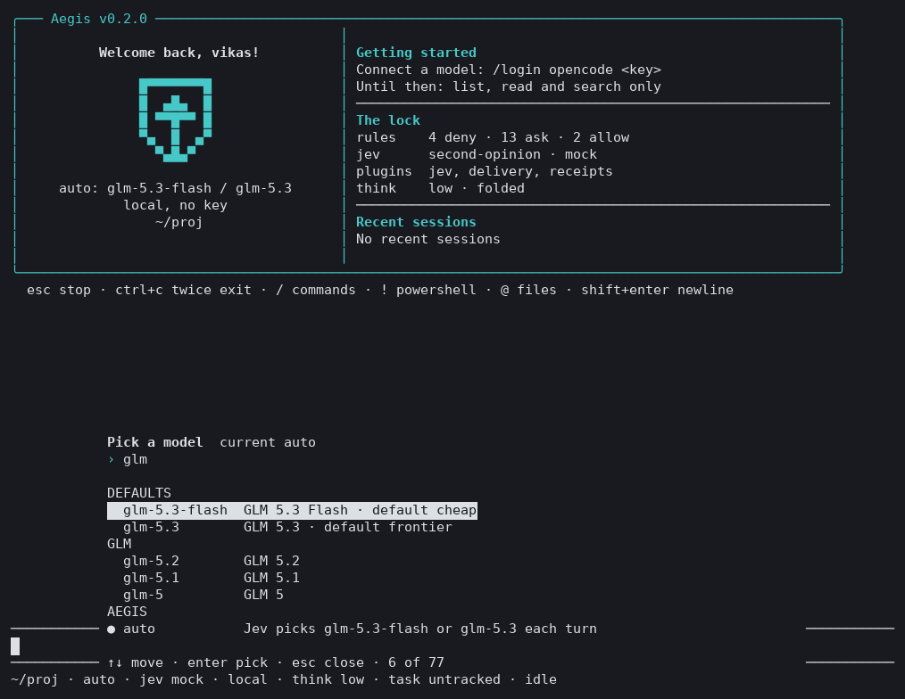
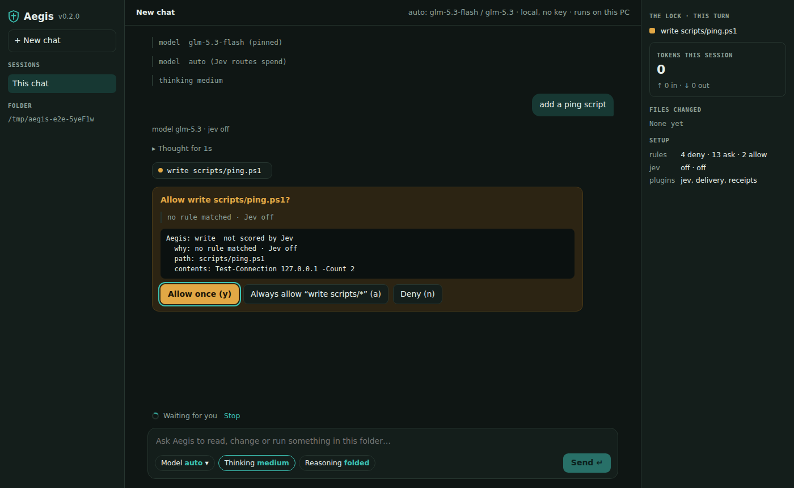
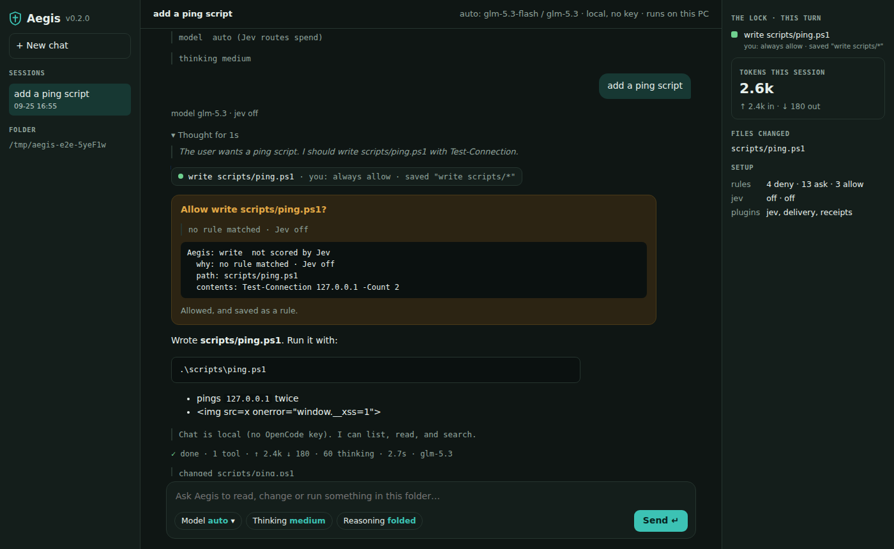

# Aegis

The coding agent you own. Rules decide first; plugins add the rest.

Other agent CLIs just run. Every Aegis tool call passes a lock first: your rules in `.aegis/settings.json`, then (optionally) Jev's spend/danger score, then you — default **n**.



| `/` commands | A turn: each tool shows what decided it |
| --- | --- |
|  |  |

| `/model` picker |
| --- |
|  |

Screenshots are the real `aegis` in a pseudo-terminal (`--local`, no model key).

### Aegis Studio — the same core in your browser

`aegis ui` opens a chat page served from your own PC (127.0.0.1 only, with a one-time key in the link). Same rules, sessions and plugins as the terminal; approvals are cards with **Allow once**, **Always allow "rule"** and **Deny**.

| Approval card | Finished turn: why each tool ran, tokens |
| --- | --- |
|  |  |

Screenshots are the real Studio in Chromium with a scripted model.

## 1. Install

Windows PowerShell (needs Node.js 22.19+):

```powershell
irm https://raw.githubusercontent.com/vikas53953/Ages/main/install.ps1 | iex
```

Linux, macOS, or a cloud container:

```bash
curl -fsSL https://raw.githubusercontent.com/vikas53953/Ages/main/install.sh | sh
```

Or with npm directly (any branch, tag or commit in place of `main`):

```bash
npm install -g https://github.com/vikas53953/Ages/archive/main.tar.gz
```

Until the work branch is merged, install it instead:

```powershell
npm install -g https://github.com/vikas53953/Ages/archive/claude/quirky-ramanujan-6bpqc3.tar.gz
```

(Not `github:vikas53953/Ages` — npm 10 links git installs to a temporary clone it deletes afterwards.)

Check it:

```powershell
aegis --version
```

## 2. Check this PC

```powershell
aegis doctor
```

One line per check (Node, sign-ins, chat model and network, Claude Code, rules, PowerShell, MCP, terminal), each with the fix.

## 3. Start

In the folder you want it to work in:

```powershell
cd C:\path\to\project
aegis
```

A terminal opens the full-screen TUI with the welcome screen. `aegis --repl` is the plain prompt (pipes, scripts). `aegis "a question"` answers once and exits.

## 4. Connect a model

**With your ChatGPT plan** (Plus / Pro / Business). No API key needed:

```text
/login chatgpt              a short code to type at auth.openai.com (works behind firewalls)
/login chatgpt browser      or sign in in this PC's browser
```

The sign-in is saved to `~\.aegis\auth.json`, readable only by your Windows account, and renews itself. `/logout chatgpt` forgets it.

**Or with an API key.** Saved to `~\.aegis\.env` for every folder:

```text
/login opencode <your-key>
/login openai <your-key>
/login jev <your-typesafe-key>      (optional: turns on Jev scoring)
```

**With your Claude plan** (Pro / Max), through the real Claude Code:

```text
/model claude-code          turns run in the Claude Code you installed and signed in to
/model auto                 back to Aegis's own loop
```

Aegis starts your unmodified Claude Code (`claude -p`), which Anthropic permits with your own plan. Claude Code does the work. Before every tool call its hook asks Aegis, and the same rules, Jev and y/a/N approvals decide. If Aegis can't answer, the call is blocked. Install Claude Code from https://claude.com/claude-code and run `claude` once to sign in.

Aegis never signs in to Claude.ai or Google itself: Anthropic and Google don't allow third-party apps to use those plan logins. Gemini is API-key only.

## Everyday commands

| Type | What happens |
| --- | --- |
| `/` | command list (autocomplete); `@` completes file names |
| `/help` | every command, core and plugins |
| `/model` | model picker (type to filter, Enter picks); `/model glm-5.3` pins directly, `/model auto` lets Jev pick |
| `/think low\|medium\|high\|off` · `/think fold\|show\|hide` | how hard the model thinks · how its reasoning appears; `ctrl+t` folds/opens it |
| `/theme aegis\|light\|contrast` | colours, saved for every folder |
| `/bell all\|ask\|done\|off` | the terminal bell when a question waits for your y/a/N or a turn over 5 s ends (Windows Terminal flashes the tab), so you can work in another window; saved for every folder. Studio marks its tab title instead |
| `aegis ui` | Aegis Studio in the browser (`--port N`, `--no-open`) |
| `/compact` | fold old turns into a summary (also automatic when history is big) |
| `/jev off\|second\|every` | Jev mode — jev plugin |
| `/task` | delivery card (confirm / accept are owner-only) — delivery plugin |
| `/status` · `/login` | what is loaded · which keys are set |
| `!dir` · `!!dir` | run PowerShell yourself; output joins the chat · or doesn't |
| `esc` | stop the running turn (at a y/N prompt: no); queued messages come back to the editor |
| Enter while busy | queues the message; it is sent when the turn ends |
| `shift+tab` | plan mode on/off |
| `/copy` · `/export [md\|jsonl]` | last answer to the clipboard · the conversation to `.harness/exports` |
| `/rules` · `/rules remove 3` · `/rules deny webfetch *` | every rule the lock uses, numbered, with where it comes from (built-in, always on, the project's file, yours, this run). Remove one of your saved "always allow" rules, or add a stricter deny/ask for this folder. `/permissions` works too |
| `a` at a prompt | always allow: saves a narrow rule (`edit scripts/*`, or that exact command) so it stops asking |
| `ctrl+c` | stop a turn / clear the prompt; twice on an empty prompt exits |
| `/plan` · `/plan go` · `/plan off` | plan mode: read and search only, ends with a numbered plan; `go` carries it out (`/plan <task>` plans it at once) |
| `/mcp` · `/mcp trust <name>` | MCP servers and tools (`mcp__server__tool`, gated by your rules, e.g. `ask mcp__github__*`); a project's servers start only after you trust them. A server is a program (`"command"`, `"args"`) or a URL: `"github": { "url": "https://api.githubcopilot.com/mcp/", "headers": { "Authorization": "Bearer ${GITHUB_TOKEN}" } }` in `~/.aegis/settings.json` under `mcp.servers` (https only, or http on localhost; `${NAME}` reads your environment, in your own settings only) |
| `/skills` · `/skill:<name>` · `/<your-command>` | skills (SKILL.md, loaded when needed) and your own commands from `~/.aegis/commands/*.md`; a project's need `/skills trust` |
| `/review` · `/review main` · `/review commit <sha>` | a read-only review of your changes with P0–P3 findings and a verdict |
| read · grep · glob | read takes `offset`/`limit` for big files; grep takes `glob`, `caseSensitive` and `context` lines, skips `.gitignore`d, binary and huge files, and says how many hits it did not show; glob lists files by pattern, newest first. All three are allowed by default (`read *`, `grep *`, `glob *`) |
| multi_edit | several changes to one file in one step, all or nothing, like Claude Code's MultiEdit. It passes the lock as `edit` (your `edit` rules cover it), and the question shows every change |
| agent (custom agents) | your own helpers in `~/.aegis/agents/<name>.md` (Claude Code's format: `name`, `description`, `tools`, `model: haiku` for the cheaper model; the text is its instructions). The agent hands one a task; it works in a fresh conversation with only its listed tools (read, grep, glob when none are listed), every call passes your rules, it cannot start other agents, and its report comes back as data. Allow one with `agent <name>`. A project's `.aegis/agents` or `.claude/agents` wait for `/skills trust`, and yours win a name clash; `/agents` lists them. Unlike Claude Code, an agent file with no `tools` line gets read, grep and glob only |
| explore | the agent hands an open-ended search ("where is login handled?") to a read-only helper on the cheaper model with a fresh context; you get its short report, not every file it read. Each read still passes your rules; allowed by default (`explore *`), also in plan mode |
| `@path` in a prompt | attaches that file (or lists that folder) to your message, like Claude Code and Pi; each one is a read through your rules, so `deny read .env` keeps it out. `@` autocompletes paths |
| `@shot.png` · a pasted image path | the image goes to the model with your message (PNG, JPEG, GIF, WebP; up to 4, 5 MB each), after the same read rules. Only that turn gets the image; the saved chat keeps a one-line note. A model without vision gets the note and Aegis tells you; with the Claude Code engine, Claude opens it with its own Read. Explorer's "Copy as path" (with quotes) works. The agent's own `read` of an image file shows it the image the same way. In Aegis Studio, paste (ctrl+v) or drop a screenshot into the message box |
| webfetch | the agent reads a web page when a rule allows its host: `allow webfetch learn.microsoft.com`, `allow webfetch *.github.com`; https only, public addresses only, other-site redirects checked separately; the page is marked as untrusted data |
| websearch | with your own Brave Search API key (`BRAVE_API_KEY` in `%USERPROFILE%\.aegis\.env`), the agent can search the web: titles, links and snippets, marked as untrusted data. Every query passes the lock (with no rule it asks: a query can carry data out); `allow websearch *` to stop the questions. No key, no tool |
| remember | the agent can ask to keep a short fact for later sessions here (like Claude Code's auto memory). You see the exact note and answer y or N every time: memory goes into every later prompt, so there is no "always", no allow rule can skip it, and `-p` or `--yes` never keeps one (nobody reads the question). A shell command that touches `.harness` or `.aegis` always asks too. Notes that look like secrets are refused. `/memory` lists them, `/memory remove <n>` forgets one |
| `/todos` | the agent's todo list (shown above the prompt and in Studio while work is open) |
| `/search firewall` | past conversations here that mention it (your messages and the answers), numbered with the line around the hit; `/resume 2` opens one |
| `/sessions` · `/resume 2` | your recent conversations, numbered with their first prompt; a number (or an id) opens one |
| `/init` | the agent looks around and writes a first `AGENTS.md` (you approve the write). Your own `~/.aegis/AGENTS.md` applies to every project, and `AGENTS.local.md` to one project just for you |
| `/fork` · `/fork 1` | copy this conversation into a new session and continue there (the original stays; `/resume` it). `/fork 1` leaves out your last turn to try it another way |
| `/diff` · `/diff stat` · `/diff notes.txt` | every file the agent changed in this session, as a diff against how it was before (from the restore points: no git needed, nothing is run). Secret-looking values are cut; shell changes are not tracked |
| `/rewind` · `/rewind 1` | restore points; put files and chat back to before a turn (`files` or `chat` for one). Shell changes are not undone |
| `aegis -p "task"` · `-p --json` | headless for scripts/CI: rules decide, nothing asks; JSON lines with `--json`; exit 2 if a call was denied; `git diff \| aegis -p --stdin "review"` adds stdin |
| `aegis -p --allow "shell npm test" --deny "webfetch *" "task"` | rules for this one run (repeatable), like Claude Code's `--allowedTools`; never saved; the always-on asks still win (and in -p an ask is a no) |
| `aegis --worktree=fix-login` | work in a separate git worktree (`<repo>.worktrees/fix-login`, branch `aegis/fix-login`): the agent's changes never touch your checkout until you merge the branch. The same name reuses it; `--worktree` alone picks a name |
| `aegis -c` · `aegis -r` | continue the last session (every launch is otherwise new, like Pi) · start with your recent sessions listed, then `/resume 2` |

## In GitHub Actions

`action.yml` runs `aegis -p` in a workflow with the same lock: rules decide, nothing can ask (a question is a No), and shell stays off unless the job sets `AEGIS_ALLOW_SHELL=1`.

```yaml
- uses: vikas53953/Ages@main
  id: aegis
  with:
    prompt: Review the changed files for secrets and risky PowerShell.
    allow: |
      read *
    deny: |
      webfetch *
  env:
    OPENCODE_API_KEY: ${{ secrets.OPENCODE_API_KEY }}
- env:
    ANSWER: ${{ steps.aegis.outputs.answer }}   # model output: pass it as data, never paste it into a script
  run: printf '%s\n' "$ANSWER"
```

The prompt goes in as data (an environment variable), so PR text in it cannot run as a script. `args` is trusted as written: never put event data (PR titles, comments) there. Pin the action to a commit SHA rather than `@main` for anything that matters. Outputs are `answer`, `exit-code` (2 = a call was denied; `fail-on-denied: false` keeps going) and `log` (JSON lines). The answer also goes to the job summary.

## The lock

Rules decide first (deny, then ask, then allow). Paths are matched relative to the folder, so `C:\proj\.git\x` is `.git/x`. Jev only scores what no rule matches, and can only make a decision stricter. With no Jev key, reads and allowed calls still run and everything else asks you. "Always allow" is never offered when an ask rule matched, for chained or wrapped commands (`pwsh -c`, `cmd /c`, `iex`), or for `.git`, `.harness`, `.aegis`. Shell (PowerShell) stays off unless `AEGIS_ALLOW_SHELL=1`. None of this is OS isolation: generated code runs with your rights.


### Whose settings count

- **Yours, for this folder** — `~/.aegis/projects/<id>/settings.json`. "Always allow", `/jev` and `/think` save here, where the agent's tools cannot write. `/status` shows the path.
- **The project's** — `.aegis/settings.json`, which may come with a cloned repo. Its deny and ask rules, Jev mode and thinking settings always apply. Its **allow rules and plugin list only apply after you `/trust` it**: `/trust` shows what it would add, and `/trust yes` trusts those exact bytes. If the file changes (a `git pull`), it asks again. `/trust off` stops trusting it. In CI you control, use `aegis -p --trust-project` (or `AEGIS_TRUST_PROJECT=1` in the real environment; a project `.env` cannot set it).
- **Lists add up.** Deny, ask and allow lists in any file add to the defaults; they no longer replace them. To make reads ask, add an ask rule (`"ask": ["read *"]`). An untrusted project file also cannot raise your spend: its thinking level and a busier Jev mode wait for `/trust` (it can still turn Jev off, which only means more questions).
- **Secrets** — reading or grepping `.env*`, `*.pem`, `*.key`, `*.pfx`, SSH keys, `.aws/credentials`, `.npmrc`, `.netrc`, `.git-credentials`, `credentials.json` and similar is always asked about (no "always"); grep over a folder skips them and says so. Any Aegis tool output (reads, grep, web pages, MCP) has secret-looking values cut before the model sees them: AWS/GitHub/OpenAI/Slack/Google keys, private-key blocks, JWTs, and `NAME_KEY=value` lines (the name stays). Claude Code engine turns produce their own tool output, so this cut does not apply there.
- **Always on** — the default deny rules (`.git`, `.harness`) and ask rules (deletes, `git push`, firewall, …), plus asking before any write to `.aegis/*`. No file can remove them. A linked (symlinked) `.aegis` folder or settings file is refused.

### Hooks (Claude Code format, tighten-only)

Put hooks in **your** `~/.aegis/settings.json` (never read from a project):

```json
{ "hooks": { "PreToolUse": [ { "matcher": "Bash|Write", "hooks": [ { "type": "command", "command": "C:\\tools\\check.ps1", "timeout": 30 } ] } ] } }
```

`PostToolUse` hooks run after a call you allowed (a linter, `gitleaks`): they cannot undo it, but what they report (exit 2 with stderr, `{"decision":"block","reason":…}` or `additionalContext`) goes back to the model with the result, and a hook that crashes is reported as "check unknown", never as a pass. The hook gets Claude Code's JSON on stdin (`tool_name` like `Write`/`Bash`, `tool_input` with `file_path`), so scripts written for Claude Code work. Exit 2 (or `permissionDecision: "deny"`) blocks the call and stderr is the reason; `"ask"` makes Aegis ask you even when a rule allows it. `"allow"` is ignored: hooks can only make the lock stricter. A hook that crashes or times out (default 60 s) turns the call into a question. Shell form runs in PowerShell; use `"command": "node", "args": ["check.mjs"]` for exec form.

## Layers

A small core (loop, tools, session, compaction, router, rules gate, TUI) and plugins (`jev`, `delivery`, `receipts`) listed under `"plugins"` in `.aegis/settings.json`. See `PROJECT-MAP.md`.

## Develop

```powershell
git clone https://github.com/vikas53953/Ages; cd Ages; npm install
npm start              # run from source (tsx)
npm test               # Vitest
npm run check:windows  # end-to-end checks (real PowerShell on Windows)
npm run build          # compile to dist/ — commit dist/ with your change (installs run it; CI checks it is fresh)
```

Every push runs typecheck, Vitest, the end-to-end check and an install test on a Windows runner (`.github/workflows/windows-check.yml`).
